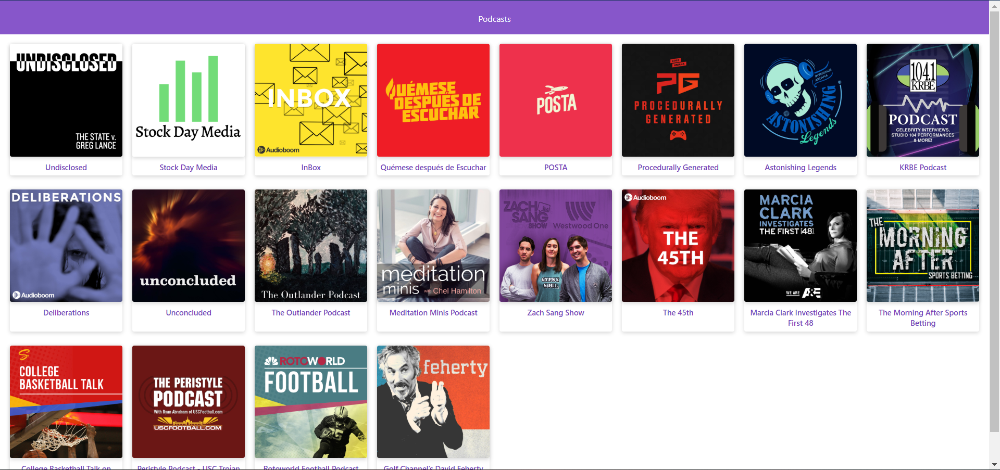

# Podcast App Made with Next

[Demo](https://next-podcasts-uswuhafjeg.now.sh/)

## How it works?

- npm install to install dependecies
- npm run dev to run the App
- npm run build && npm run start to run in production
